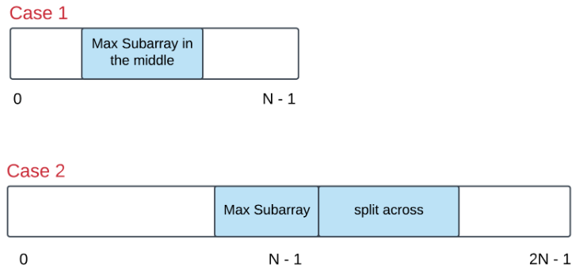

# 918. Maximum Sum Circular Subarray (MEDIUM)

## Table Of Contents

- [918. Maximum Sum Circular Subarray (MEDIUM)](#918-maximum-sum-circular-subarray-medium)
  - [Table Of Contents](#table-of-contents)
  - [Description](#description)
  - [Hints](#hints)
  - [Result Details](#result-details)

## Description

Given a circular integer array nums of length n, return the maximum possible sum of a non-empty subarray of nums.

A circular array means the end of the array connects to the beginning of the array. Formally, the next element of nums[i] is nums[(i + 1) % n] and the previous element of nums[i] is nums[(i - 1 + n) % n].

A subarray may only include each element of the fixed buffer nums at most once. Formally, for a subarray nums[i], nums[i + 1], ..., nums[j], there does not exist i <= k1, k2 <= j with k1 % n == k2 % n.

Example 1:

```text
Input: nums = [1,-2,3,-2]
Output: 3
Explanation: Subarray [3] has maximum sum 3.
```

Example 2:

```text
Input: nums = [5,-3,5]
Output: 10
Explanation: Subarray [5,5] has maximum sum 5 + 5 = 10.
```

Example 3:

```text
Input: nums = [-3,-2,-3]
Output: -2
Explanation: Subarray [-2] has maximum sum -2.
```

Constraints:

- `n == nums.length`
- `1 <= n <= 3 * 104`
- `-3 * 104 <= nums[i] <= 3 * 104`

## Hints

- For those of you who are familiar with the Kadane's algorithm, think in terms of that. For the newbies, Kadane's algorithm is used to finding the maximum sum subarray from a given array. This problem is a twist on that idea and it is advisable to read up on that algorithm first before starting this problem. Unless you already have a great algorithm brewing up in your mind in which case, go right ahead!
- What is an alternate way of representing a circular array so that it appears to be a straight array? Essentially, there are two cases of this problem that we need to take care of. Let's look at the figure below to understand those two cases:

    

- The first case can be handled by the good old Kadane's algorithm. However, is there a smarter way of going about handling the second case as well?

## Result Details

...
