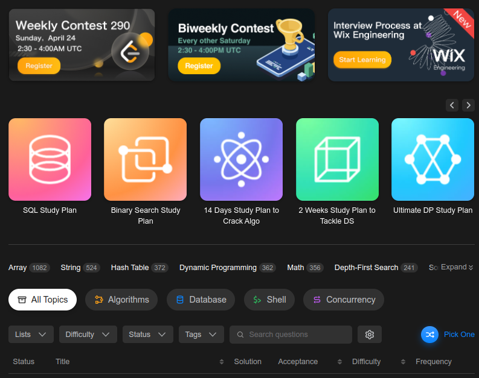
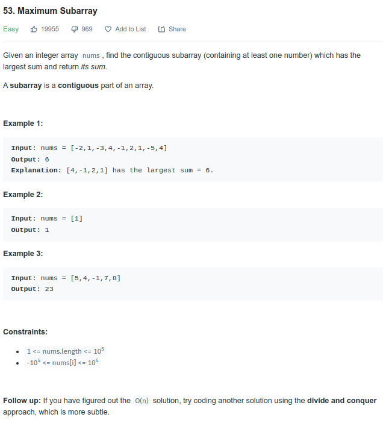

# LeetCode

## Table Of Contents

- [LeetCode](#leetcode)
  - [Table Of Contents](#table-of-contents)
  - [About](#about)
  - [Template](#template)
  - [Support Me](#support-me)

## About

Here I publish my `LeetCode` solutions

Officially this repository starts at the date 18th May, 2022.

The goal is to solve AT LEAST 2 problems, and AT MOST 3 problems, per day.

For guidance on what problems to solve, I will use the following guides on the dashboard of `LeetCode`.

These are my steps,

1. Finish all the study plans as outlined, `SQL Study Plan`, `Binary Search Study Plan`, `14 Days Study Plan To Crack Algo`, and so on
2. Approach questions by `TOPICS` filtered by difficulty in `DESCENDING` order (starting from `HARD` problems)

## Template

Please follow the steps and copy the following template to generate a folder for a new problem.

1. Create a folder with the following format, `<PROBLEM_NUMBER>. <PROBLEM_NAME> (<PROBLEM_DIFFICULTY>)`
2. Create a `README.md` in the folder
3. Fill the `README.md` with the following template for the content,

    ~~~markdown
    # <PROBLEM_NUMBER>. <PROBLEM_NAME> (<PROBLEM_DIFFICULTY>)

    ## Table Of Contents

    - [<PROBLEM_NUMBER>. <PROBLEM_NAME> (<PROBLEM_DIFFICULTY>)](#problem_number-problem_name-problem_difficulty)
      - [Table Of Contents](#table-of-contents)
      - [Description](#description)
      - [Hints](#hints)
      - [Result Details](#result-details)

    ## Description

    ...

    ## Hints

    ...

    ## Result Details

    ...

    ~~~

4. Copy paste the material starting from `<PROBLEM_NUMBER>. <PROBLEM_NAME>` to `Constraints` in the description

    

5. Copy paste the `Hint` or `Follow Up` under `Hints`
6. After solving, share the output generated by `LeetCode` for time and space complexity under `Result Details`
7. Create a file called `Solution.java` in the respective folder, copy paste results

## Support Me

If you like what I am doing, please `star` or `fork`. Thanks!
